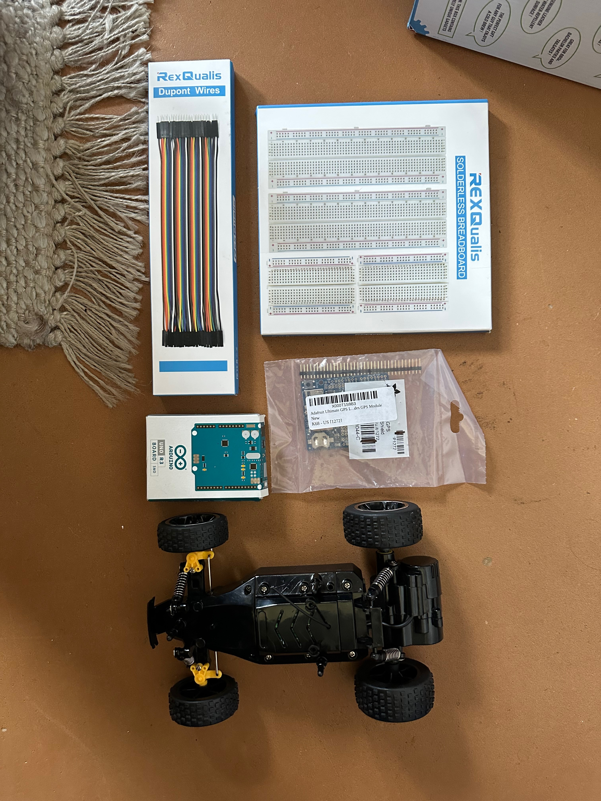

# Summary

| Date  | Notes
| :---- | :----
| 09/19 | Parts minus motor shield ordered
| 09/21 | Background literature selected
| 09/26 | Notes taken on sources
| 09/26 | GitHub repo setup (code/reports)
| 10/03 | Arduino IDE setup/tutorials

# Activities

## Parts List

I decided to base ArduRover on the Arduino platform since in-depth documentation exists for the Arduinos themselves, related "shields", and the IDE to develop for them. Here are the parts I've received so far:

- [Arduino UNO SMD REV3](https://store-usa.arduino.cc/products/arduino-uno-rev3-smd?selectedStore=us)
- [Adafruit Ultimate GPS Logger Shield](https://www.adafruit.com/product/1272)
- [HMC5883L Magentometer](https://www.adafruit.com/product/1746) (Compass)
- [Breadboard bundle](https://www.amazon.com/dp/B07DL13RZH?psc=1&ref=ppx_yo2ov_dt_b_product_details)
- [Breadboard cable bundle](https://www.amazon.com/dp/B072L1XMJR?psc=1&ref=ppx_yo2ov_dt_b_product_details)
- [2WD RC Car Chassis](https://www.amazon.com/dp/B07X8773JJ?psc=1&ref=ppx_yo2ov_dt_b_product_details)

I still need to determine which motor shield to use, but I would like to do that after our meeting on 10/5.

*Figure 1: Parts!*

## Sources

While I was waiting on parts to arrive, I dove into some background on GPS and people using it for Arduino-powered projects. The three articles I read through + took notes on were:

- “Global Positioning System – Working and its Applications” ([link](https://link.springer.com/chapter/10.1007/978-1-4020-8735-6_84))
- “An Arduino UNO Application: GPS Guided Unmanned Ground Vehicle” ([link](https://ieeexplore.ieee.org/document/8266283))
- “Tracing Path with Arduino Uno using GPS and GPRS/GSM” ([link](https://ieeexplore.ieee.org/document/8674953))

See [this PDF](https://github.com/davidd-55/ArduRover/blob/main/literature/ArduRoverSourcesNotes.pdf) for sources and notes on them. These sources were great for a quick overview of GPS and seeing its use in other Arduino-based projects!

## Arduino IDE

Since this project is using an Ardunio UNO, I spent some time getting to know the Arduino IDE and figuring out how to program the Arduino from my laptop. Here are a couple of tutorials I have come across:

- [Programming Arduino Video](https://www.youtube.com/watch?v=fJWR7dBuc18)
- [Arduino Docs](https://docs.arduino.cc/tutorials/)
- [TutorialsPoint Docs](https://www.tutorialspoint.com/arduino/index.htm)

# Plans

Main plans for the next two weeks include:

- Finalize car choice (hobby vs. current)
- Choose/order motor shield
- Register for Mudd makerspace
- Wire GPS + compass hardware
- Read GPS + compass data
- start working with the Nano and cameras.

# Issues

- I am a bit worried about the size of my current vehicle
- I want to start working on power/electrical diagrams, but have zero experience doing so
