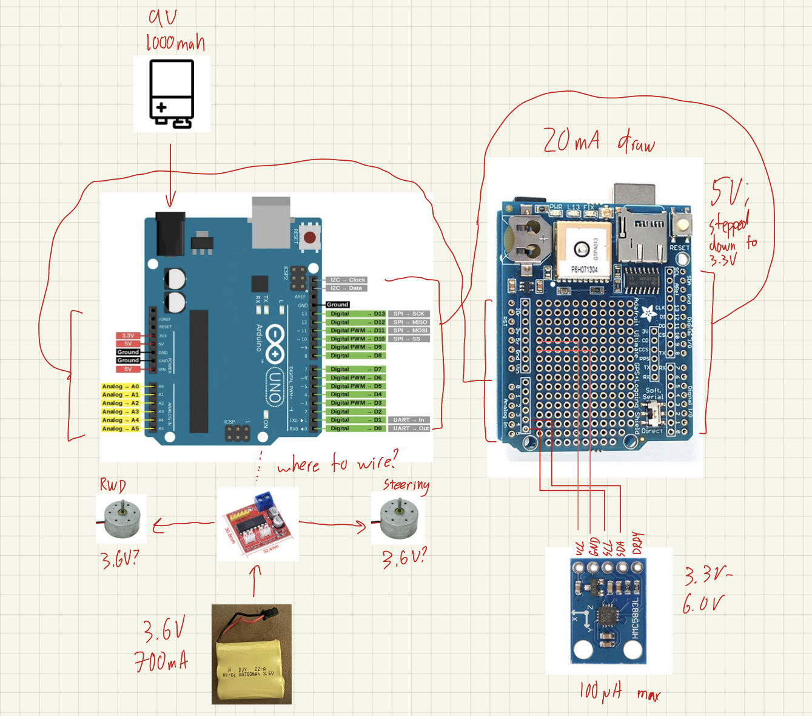

# Summary

| Date  | Notes
| :---- | :----
| 10/07 | Motor controller ordered
| 10/09 | Mudd makerspace access granted
| 10/12 | 9V rechargeable battery ordered
| 10/18 | Wiring diagram mocked up

# Activities

## Parts Update

The last parts I needed to acquire after the previous project report were a motor controller, battery for the Arduino/electronics, and a buck boost converter. The motor controller and battery have been ordered:

- [MX1919 2.5A Dual Bridge Motor Controller](https://www.amazon.com/Bridge-Brushed-Controller-Arduino-Consumption/dp/B07Q5HS8KS)
- [Rechargeable 9V 1000 mAh Battery](https://www.amazon.com/gp/product/B09ZL3XMDJ)
- [9V Battery to Barrel Plug Converter](https://www.amazon.com/gp/product/B07T7VX2SF)

As for the buck boost converter, I'd like to work through the current wiring diagram withg Prof. Clark a little bit more before ordering one.

In addition to purchasing these parts, I have also decided to stick with the smaller RC car platform rather than switching to a larger hobby-grade chassis.

## Wiring Diagram

After spending some time digging around and trying to educate myself on how electronics work, I think I have a decent wiring diagram (at least for the Arduino/GPS electronics). An iPad sketch can be found below:

I'll definitely still need to work on addressing the motor diagram, but I have a few questions before wrapping that up.

## Programming Basics

I spent some time over the past two weeks getting acquainted with Arduino programming conventions. Alongisde reading over [basic style conventions](https://courses.ideate.cmu.edu/16-223/f2016/text/resrc/coding-style-guide.html), I now understand the "setup()" and "loop()" functions a bit more, and I've gotten a chance to do some test programming by [following some tutorials](https://microcontrollerslab.com/arduino-programming-tutorial-beginners/).

# Plans

Main plans for the next two weeks include:

- Finalize wiring diagram
- Create component platform for vehicle
- Wire motor controller
- Read GPS + compass data

# Issues/Questions

- With the GPS shield taking up most pins on the Arduino, can I just solder the compass into the passthrough on the GPS shield? (see diagram)
- Is the 9V power supply setup okay? 
- If possible, it would be great to talk through where the buck boost converter is used again. It seems like I won't need one since the motors and Arduino will be on separate power supplies, but I just want to double check if this is the correct understanding.
- Is it worth trying to 3D print or CNC a platform? Or should I just start hacking at some small plywood or balsa?
