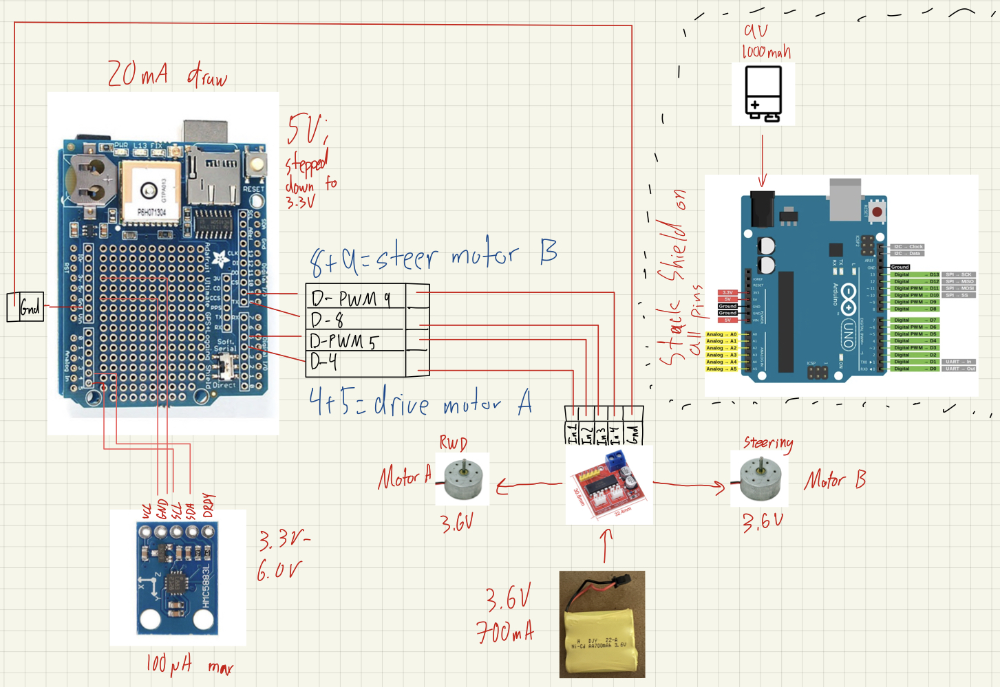

# Summary

| Date  | Notes
| :---- | :----
| 10/22 | Read GPS Data
| 10/24 | Wiring diagram finalized
| 10/25 | Wire Compass
| 10/27 | Read Compass Data
| 11/01 | Design Car Platform

# Activities

## Software Baby Steps!

#### 1) Reading GPS Data

After soldering the Adafruit GPS shield with Prof. Clark on 10/21, I installed the [Adafruit GPS Library](https://www.arduino.cc/reference/en/libraries/adafruit-gps-library/) and loaded up the "GPS_HardwareSerial_Parsing" sketch to successfully read data. The code can be found [here]().

#### 2) Reading Compass Data

The compass was a bit trickier since the HMC5883L board I bought is not from a larger company like Adafruit. However, I was able to cobble together some code to read raw values off of the sensor [here]().

## Final Wiring Diagram

Motor Controller Wiring???

An updated iPad sketch can be found below:

## Car Platform Design

I am currently planning on the electronics platform being apprx. 8 inches long by 5 inches wide. This will give enouch space for the Arduino + GPS module to be situated long ways toward the rear of the vehicle, the compass on an elevated "antenna" in the center, and the 9V battery for the Arduino + navigational electonics towards the front. 

Like the original RC car design, I would like to situate the motor controller underneath the electronics platform. A rough draft of this setup can be seen in the picture below:

# Plans

Main plans for the next two weeks include:

Hardware:
- Make final wiring connections (compass; motor controller)
- Complete platform package

Software:
- Make sense of GPS + compass data
- Create unified sketch that can interpret both streams

# Issues/Questions
- NA
